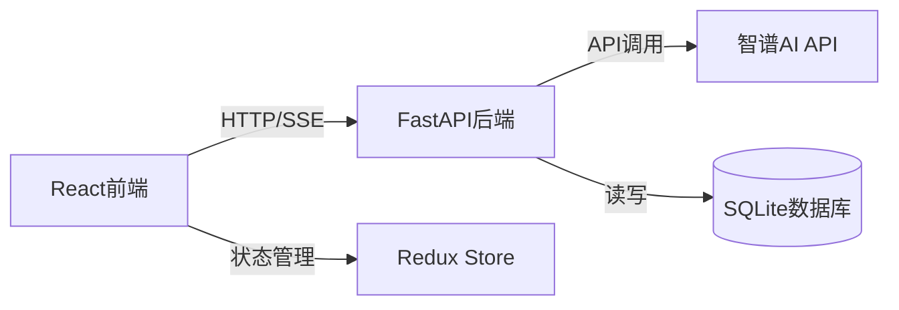

# 智谱AI聊天网站开发计划

## 项目架构




## 技术栈

**前端:**

- React 18 + Vite
- TailwindCSS（小清新样式）
- Redux Toolkit（状态管理）
- Axios（HTTP请求）
- react-markdown + react-syntax-highlighter（Markdown和代码高亮）
- framer-motion（动画效果）

**后端:**

- FastAPI（Python 3.9+）
- SQLAlchemy + SQLite（数据持久化）
- SSE（Server-Sent Events，实现流式响应）
- 复用现有的 [`test_zhipu_api.py`](test_zhipu_api.py) 中的智谱API调用逻辑

## 目录结构

```javascript
building_agent/
├── backend/                    # FastAPI后端
│   ├── main.py                # 主应用入口
│   ├── models.py              # 数据库模型
│   ├── database.py            # 数据库配置
│   ├── zhipu_service.py       # 智谱API服务（基于test_zhipu_api.py）
│   ├── schemas.py             # Pydantic数据模型
│   └── requirements.txt       # Python依赖
├── frontend/                   # React前端
│   ├── src/
│   │   ├── components/        # React组件
│   │   │   ├── ChatHistory.jsx      # 左侧历史面板
│   │   │   ├── ChatMain.jsx         # 中间聊天主界面
│   │   │   ├── MessageBubble.jsx    # 消息气泡
│   │   │   ├── InputBox.jsx         # 输入框
│   │   │   └── ThinkingToggle.jsx   # thinking模式开关
│   │   ├── store/             # Redux状态
│   │   ├── services/          # API服务
│   │   ├── App.jsx            # 主应用
│   │   └── main.jsx           # 入口
│   ├── package.json
│   └── tailwind.config.js
├── .env                        # 环境变量（ZHIPU_API_KEY）
└── test_zhipu_api.py          # 现有代码（保留）
```


## 实施步骤

### 1. 后端开发（FastAPI）

**数据库模型设计：**

- `Conversation` 表：会话ID、标题、创建时间、更新时间
- `Message` 表：消息ID、会话ID、角色（user/assistant）、内容、时间戳、thinking模式

**API端点设计：**

- `POST /api/conversations` - 创建新对话
- `GET /api/conversations` - 获取所有对话列表
- `GET /api/conversations/{id}/messages` - 获取对话的消息历史
- `POST /api/chat/stream` - 流式聊天（SSE）
- `DELETE /api/conversations/{id}` - 删除对话

**关键实现：**

- 在 [`backend/zhipu_service.py`](backend/zhipu_service.py) 中复用 [`test_zhipu_api.py`](test_zhipu_api.py) 的 `get_zhipu_response_converse` 函数
- 使用 FastAPI 的 `StreamingResponse` 实现流式输出
- 支持 thinking 参数（"disabled" 或 "enabled"）

### 2. 前端开发（React）

**页面布局：**

```javascript
┌─────────────┬─────────────────────────────┐
│             │  Chat Header                │
│  Chat       ├─────────────────────────────┤
│  History    │                             │
│  Sidebar    │  Message Bubbles            │
│             │  (User + AI)                │
│  - New Chat │                             │
│  - Session1 │                             │
│  - Session2 │                             │
│             ├─────────────────────────────┤
│             │  Input Box + Send Button    │
└─────────────┴─────────────────────────────┘
```

**UI/UX设计特色（小清新风格）：**

- 柔和的配色方案：薄荷绿、天蓝色、浅粉色
- 圆角设计、柔和阴影
- 打字机动画效果（AI回复时）
- 消息发送的淡入动画
- 悬停时的微妙放大效果
- 渐变背景
- 响应式布局

**核心组件：**

1. **ChatHistory.jsx**：显示会话列表，支持切换和删除
2. **ChatMain.jsx**：主聊天区域，展示消息流
3. **MessageBubble.jsx**：消息气泡，支持Markdown渲染和代码高亮
4. **InputBox.jsx**：输入框，支持Enter发送、thinking模式切换
5. **ThinkingToggle.jsx**：thinking模式开关按钮

**状态管理（Redux）：**

- `conversations`：会话列表
- `currentConversationId`：当前会话ID
- `messages`：当前会话的消息
- `isStreaming`：是否正在接收流式响应
- `thinkingEnabled`：thinking模式开关

**流式响应处理：**

- 使用 EventSource 或 fetch 处理 SSE
- 逐字显示AI回复内容
- 在流式过程中禁用输入框

### 3. 集成与优化

**环境配置：**

- 复用现有的 `.env` 文件中的 `ZHIPU_API_KEY`
- 后端配置 CORS 允许前端跨域请求

**数据持久化：**

- 使用 SQLite 数据库存储所有会话和消息
- 支持历史记录查询和恢复

**交互优化：**

- 自动滚动到最新消息
- 加载中状态指示
- 错误提示（API调用失败等）
- 空状态提示（无历史记录时）

### 4. 运行与测试

**启动后端：**

```bash
cd backend
pip install -r requirements.txt
uvicorn main:app --reload
```

**启动前端：**

```bash
cd frontend
npm install
npm run dev
```

访问 `http://localhost:5173` 即可使用聊天应用。

## 核心文件说明

- [`backend/zhipu_service.py`](backend/zhipu_service.py)：基于 [`test_zhipu_api.py`](test_zhipu_api.py) 的智谱API封装，改造为异步生成器以支持SSE